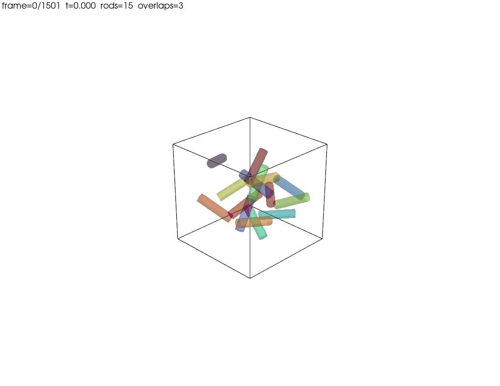
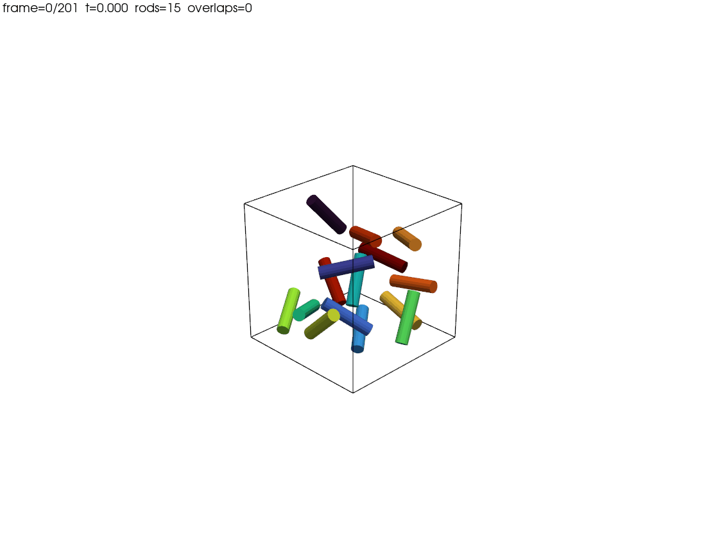

# RodSim3D

3次元箱内に閉じ込められた同一長さの細長い円筒棒を、無重力下条件で動かすシミュレータ。
棒同士の相互作用として、物理的に区別された3つのモデルを切り替えられる:

| Mode | 物理 | config |
|---|---|---|
| `NONE` | 相互作用なし、円筒同士は透過 | `configs/cylinders.toml` |
| `SOFT_REPULSION` | 連続ポテンシャルによるソフト斥力 | — (プリセットなし、`[pair_interaction] model = "soft_repulsion"` で有効化) |
| `HARD_CONTACT` | 非貫通制約 + 衝突インパルス (剛体) | `configs/cylinders_hard.toml` |

| 透過モード (NONE) | 剛体モード (HARD_CONTACT) |
|:---:|:---:|
|  |  |
| 円筒はすり抜け、交差領域をマゼンタ半透明で可視化 | 非貫通制約 + 衝突インパルスで弾む |

> `SOFT_REPULSION` の `strength` を大きくしても剛体にはならない。剛体接触は制約+インパルスの枠組み (`HARD_CONTACT`) で扱う。詳細は [`docs/理論仕様書.pdf`](docs/理論仕様書.pdf)。

---

## セットアップ

依存管理は [uv](https://github.com/astral-sh/uv) ([docs](https://docs.astral.sh/uv/))、タスクランナーは [just](https://github.com/casey/just) ([docs](https://just.systems/man/en/)) を使う。

```bash
uv sync                # 依存解決 (numpy, scipy, pyvista, numba, ...)
just                   # レシピ一覧
```

---

## 実行コマンド (DB書き出し + ビューワ起動)

`compute` で計算 → SQLite に保存、`replay` で DB を読み込み PyVista で再生。

### 1. 透過モード (NONE)

```bash
# 計算 (1200フレーム、DB に状態と交差体積を記録)
uv run rod-sim3d compute \
  --config configs/cylinders.toml \
  --db runs/cylinders.db \
  --frames 1200

# 再生 (半透明カプセル + 交差領域をマゼンタ凸多面体で描画)
uv run rod-sim3d replay \
  --db runs/cylinders.db \
  --backend pyvista
```

ショートカット:
```bash
just demo          # 上の 2 コマンドを順に実行
just demo-short    # 60フレーム + headless (動作確認)
```

### 2. 剛体モード (HARD_CONTACT)

```bash
# 計算
uv run rod-sim3d compute \
  --config configs/cylinders_hard.toml \
  --db runs/cylinders_hard.db \
  --frames 1500

# 再生
uv run rod-sim3d replay \
  --db runs/cylinders_hard.db \
  --backend pyvista
```

ショートカット:
```bash
just hard          # 上の 2 コマンドを順に実行
```

### 3. 活発にしたいとき (初期速度を大きく)

```bash
uv run rod-sim3d compute \
  --config configs/cylinders_hard.toml \
  --db runs/fast.db \
  --initial-force-scale 50 \
  --kick-duration 0.15 \
  --linear-damping 0.0 --angular-damping 0.0 \
  --frames 1500

uv run rod-sim3d replay --db runs/fast.db --backend pyvista
```

---

## ビューワ操作

| キー | 動作 |
|---|---|
| Esc / Q | 終了 |
| R | 0フレーム目に戻る |
| L | ループモード切替 |

---

## CLI ヘルプ

各サブコマンドは argparse で詳細な `--help` を持っている。

```bash
uv run rod-sim3d --help                 # サブコマンド一覧 + ワークフロー例
uv run rod-sim3d run --help             # ライブ実行のオプション
uv run rod-sim3d compute --help         # DB 書き出しのオプション
uv run rod-sim3d replay --help          # ビューワのオプション + キー操作
uv run rod-sim3d inspect --help         # 初期状態診断
```

---

## 設定ファイル要点

```toml
[system]
n_rods = 15              # 棒の本数
rod_length = 1.8         # 棒の長さ
rod_radius = 0.22        # 描画/境界半径
mass = 1.0
box = [5.0, 5.0, 5.0]

[pair_interaction]
model = "hard_contact"       # "none" | "soft_repulsion" | "hard_contact"
contact_radius = 0.22        # HARD_CONTACT 用 (省略時は rod_radius)
restitution = 0.85           # 反発係数 e (1=弾性, 0=完全非弾性)
wall_restitution = 0.9

[dynamics]
dt = 0.003
linear_damping = 0.02
angular_damping = 0.02

[initial]
seed = 21
initial_force_scale = 20.0   # σ_F
initial_torque_scale = 5.0   # σ_τ
kick_duration = 0.1          # T_kick

[render]
backend = "pyvista"
opacity = 0.55               # 円筒透過度 (NONE モードで役立つ)
```

`[pair_interaction]` を書かない場合は `pair_potential.strength` から自動推論:
`strength = 0 → NONE`、`strength > 0 → SOFT_REPULSION`。

---

## プロジェクト構造

```
rod_3d_simulation/
├── assets/            # README 用 GIF (透過 / 剛体モード)
├── configs/           # TOML 設定ファイル
├── docs/              # 物理モデルの理論仕様 PDF
├── src/rod_sim3d/     # ソース
├── tests/             # pytest テストコード
├── justfile           # タスクランナー
├── pyproject.toml     # uv 管理、ruff/ty/radon 設定
└── README.md
```

---

## License

MIT
